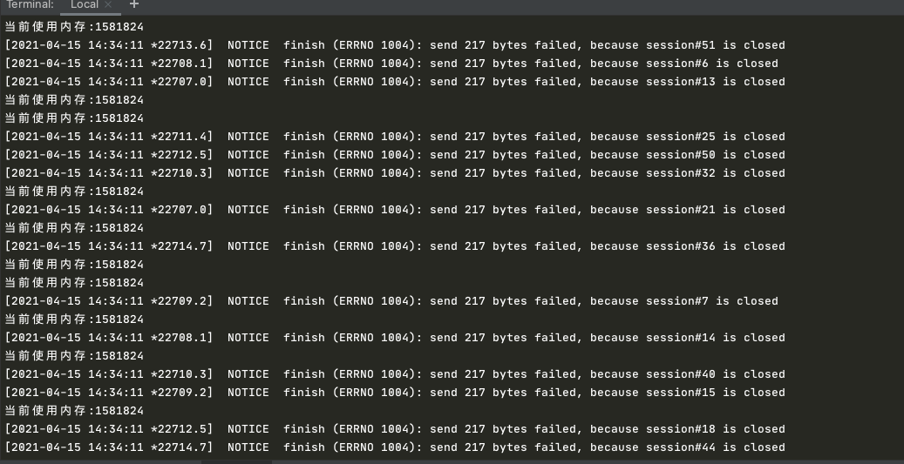
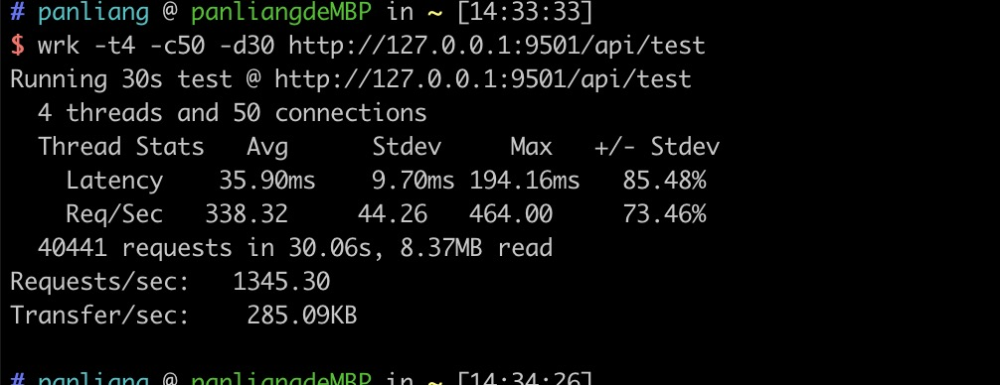
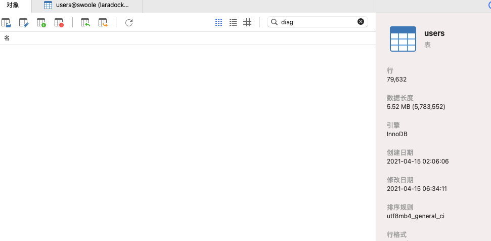
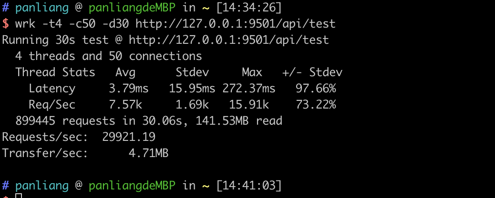
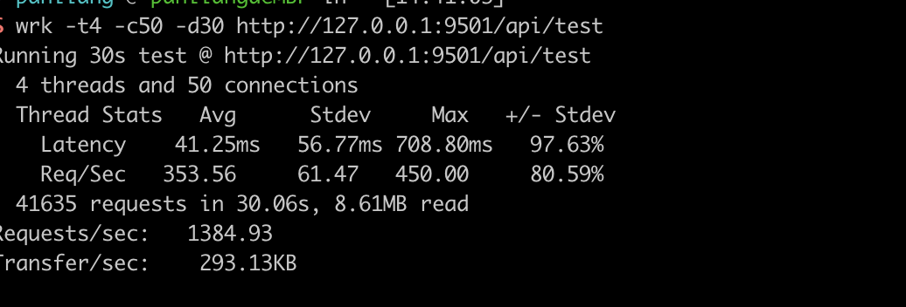

## 基于swoole搭建的一个高性能的HTTP服务器

#### 目录结构
```shell script
├── README.md
├── bin
│   ├── Client.php
│   ├── Command.php
│   ├── HttpServer.php
│   ├── Log.php
│   ├── Route.php
│   ├── ServerQueue.php
│   ├── controller
│   │   ├── Controller.php
│   │   ├── IndexController.php
│   │   └── Response.php
│   ├── exception
│   │   └── HttpException.php
│   ├── pool
│   │   ├── DB.php
│   │   ├── DbPool.php
│   │   ├── Mysql.php
│   │   ├── Mysqli.php
│   │   ├── PDO.php
│   │   └── RedisPool.php
│   ├── queue
│   │   └── Queue.php
│   ├── static
│   │   └── favicon.ico
│   └── utility
├── composer.json
├── composer.lock
├── config
│   ├── database.php
│   ├── email.php
│   ├── log.php
│   ├── route.php
│   └── server.php
├── docs
├── helpers.php
├── http.php
├── tcp.php
├── test
├── test.php
└── view
    ├── 404.html
    ├── echarts.html
    └── log_list.html
```

#### 功能简洁
  * 使用大量单例 避免使用 `static`属性 PHP全局变量产生内存泄漏问题
  * 支持简单的路由分发\控制 简洁的控制器
  * 支持redis、mysql连接池 实现了curd 以及事务操作

#### 要求

   * php版本>=7.3
   * swoole4
   
#### 安装使用
```
get clone https://github.com/pl1998/swoole_http.git
php http.php
```   

#### 全局辅助函数文件 `helpers.php 通过`composer.json`文件 中`autoload` 实现了自动加载
    * 主要实现一些全局函数 读取视图函数 view()  读取配置函数 config()
```json
    ...
   "autoload": {
        "psr-4": {
            "app\\": "bin" //主目录自动加载 映射命名空间
        },
        "files": [
            "helpers.php"
        ]
    }
    ...
```

#### 配置文件
```shell script
├── config
│   ├── database.php //数据库配置
│   ├── email.php    //邮件配置
│   ├── log.php      //日志驱动
│   ├── route.php    //路由文件
│   └── server.php  //tcp http 配置以及端口
```

#### 新增路由 `router.php`

```php
/**
 * 路由配置
 */
return [
  'GET'  => [
      '/favicon.ico'=>false,
      //访问路径 => 实例控制器 方法名 
      '/api/test'=>[\app\controller\TestController::init(),'test'],
  ],
  'POST' => [

  ],
  'PUT'  => [

  ],
  'DELETE' => [

  ]
];

```
#### 控制器
```php
namespace app\controller;

use app\pool\DbPool;

class TestController
{

    //每个控制器都应该有的单例
    protected static $init;

    public static function init()
    {
        if(is_null(static::$init)) {
            echo "加载控制器单例"."\n";
            static::$init = new self();
        }
        return static::$init;
    }
    
    //拿到请求和响应
    public function test(object $request,object $response)
    {
           //业务逻辑
                  $db = new DbPool();
          
          
                  $id = $db->table('users')->insert([
                      'name'=>'latent',
                      'password'=>'',
                      'avatar'=>'',
                      'email'=>'pltruenine@163.com',
                      'created_at'=>date('Y-m-d H:i:s'),
                      'updated_at'=>date('Y-m-d H:i:s'),
                      'uid'=>'56895',
                      'age'=>22,
                  ]);
                 
                  $response->header('Content-Type','application/json');
                  $response->end(success([
                      'id'=>$id
                  ],'插入成功'));

    }
}
```
#### 启动服务器
```shell script
php http.php
---------------
$ php http.php 
0.0.0.0:9501


```
#### 浏览器访问[0.0.0.0:9501](http://0.0.0.0:9501/api/test) 尝试多请求几次


####命令行
```shell script
$ php http.php
0.0.0.0:9501
当前使用内存:1489312
加载路由单例
加载Index控制器单例
加载Test控制器单例
当前使用内存:1584304
当前使用内存:1584304
当前使用内存:1584304
当前使用内存:1584304
当前使用内存:1584304
当前使用内存:1584304
当前使用内存:1584304
```
#### 开始测试
```shell script
wrk -t4 -c50 -d30 http://127.0.0.1:9501/api/test
```





#### 此时已经插入了3万多条数据了



#### 感觉不太行 可能是连接池的问题
```php
return [
    'mysql' =>[
        'host'=>'127.0.0.1',
        'port'=>3306,
        'coding'=>'utf8mb4',
        'dbname'=>'swoole',
        'username'=>'root',
        'password'=>'root',
        'size'=>15, //默认只给连接池15个连接
    ]
];
```
#### 我们来跑hello world

```php
 public function test(object $request,object $response)
    {
        $response->header('Content-Type', 'text/html');
        $response->end("hello world!");
  }
```


#### 这性能只比gRPC(3万多)差一万多



#### 连接池调大继续测试


#### 结论
>`Latency`参数明显高了 但`Requests/sec` 只提高了40个的样子

